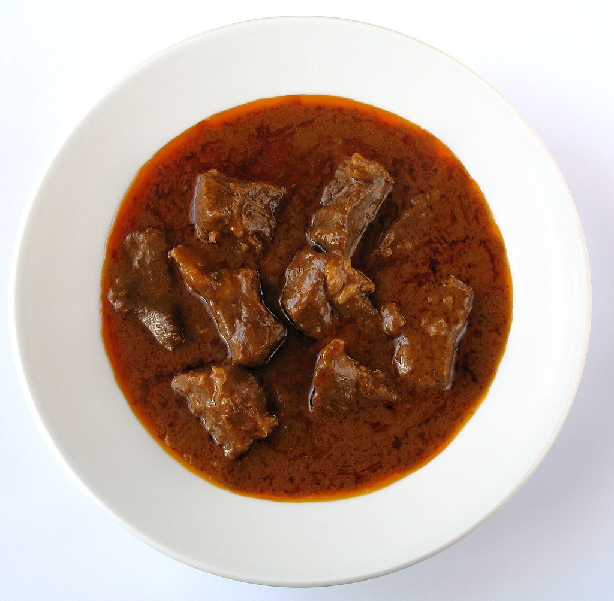

# Moja strona

## 1.

|składnik|ilość|
|---|---|
|łopatka wieprzowa|1kg|
|boczek|100g|
|cebula|1|
|marchewka|2|
|papryka|1|
|oliwa|2 łyżki|
|pieczarki|200g|
|mąka|2 łyżki|
|masło|2 łyżki|

## 2.

Mięso pokroić w kostkę ok. 1,5 cm. Boczek pokroić w małą kostkę. Cebulę obrać i pokroić w kosteczkę. Marchewkę obrać i pokroić na plasterki. Paprykę pokroić w kostkę.
W szerokim garnku rozgrzać łyżkę oliwy, dodać boczek i cebulę, zeszklić ją. Dodać drugą łyżkę oliwy, włożyć marchewkę i paprykę i mieszając podsmażać wszystko przez kilka minut.
W międzyczasie na oddzielnej patelni rozgrzać smalec (lub oliwę) i obsmażyć kawałki mięsa. Doprawić je solą i pieprzem i przenieść do garnka z warzywami. Jeśli mamy można całość podlać ok. 1/3 szklanki wina (czerwonego lub białego) i na większym ogniu chwilę odparować.
Zawartość garnka doprawić mieloną papryką i jeśli mamy czosnkiem niedźwiedzim. Wlać gorący bulion (lub rosół) w ilości aby zakryło składniki. Dodać sos sojowy, ziele angielskie i listek laurowy, przykryć i dusić na małym ogniu ok. 1 i 1/2 godziny, do miękkości mięsa. Na koniec dodać koncentrat pomidorowy i podsmażone na złoto pokrojone pieczarki.
Na patelni dobrze rozgrzać masło, dodać mąkę i chwilę podsmażyć mieszając. Przełożyć do garnka, dokładnie wymieszać i zagotować.

## .3

[wikipedia](https://pl.wikipedia.org/wiki/Gulasz)

[eng wikipedia](https://en.wikipedia.org/wiki/Goulash)
